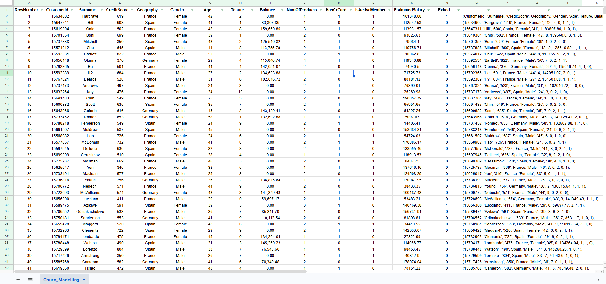
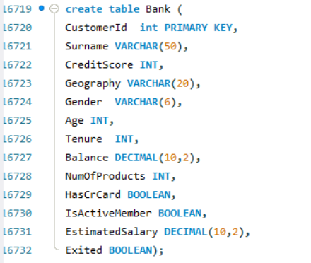
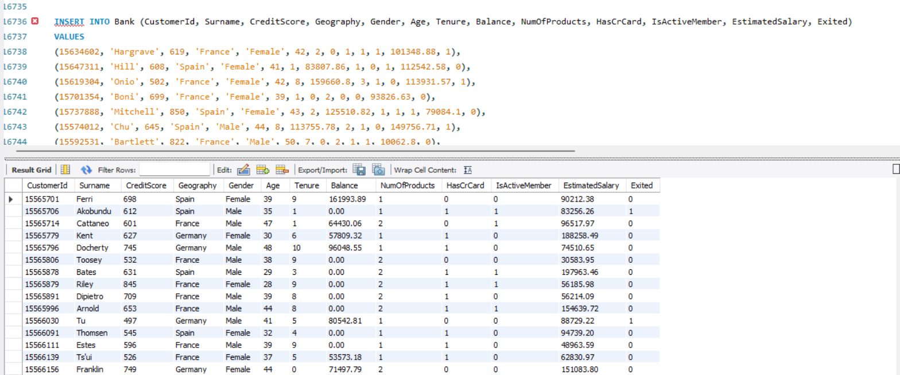
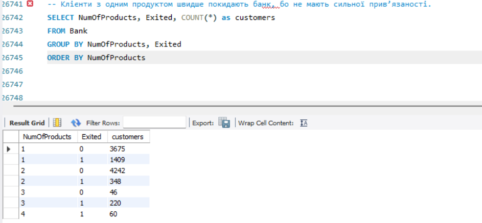
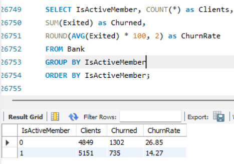
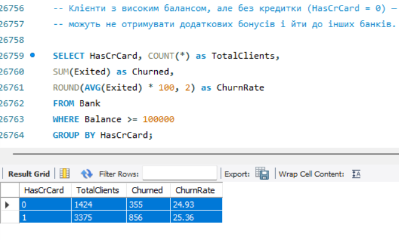
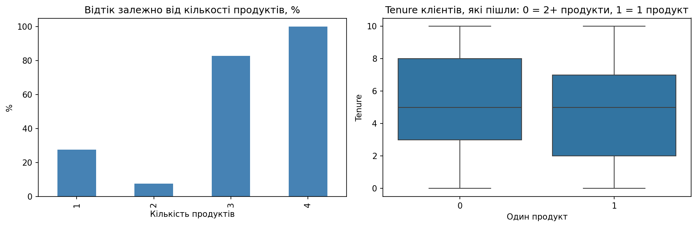
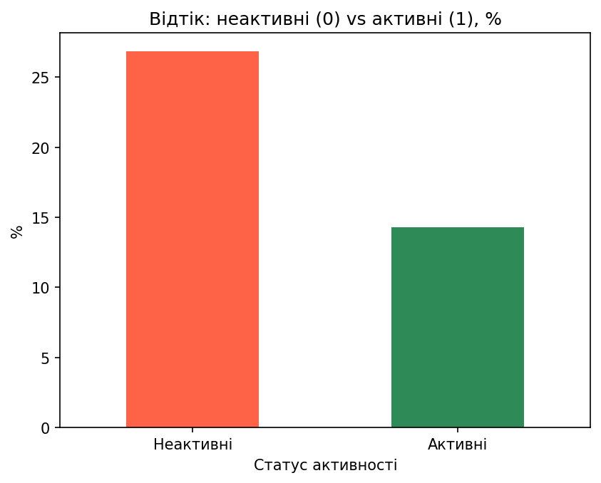
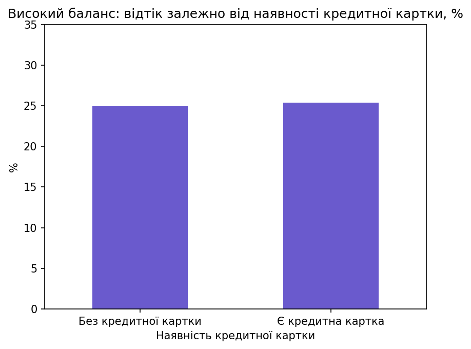
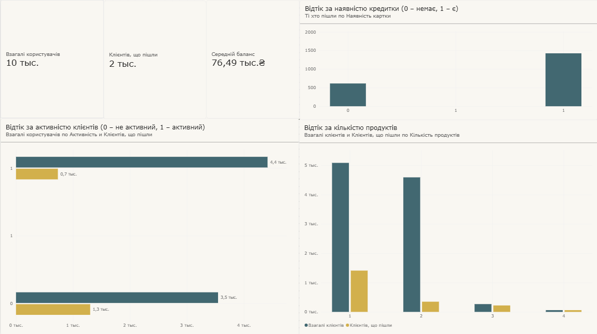

# 🏦 Bank Customer Churn Analysis — Аналіз відтоку клієнтів банку

Наскрізний аналітичний кейс: від підготовки даних і SQL-розвідки до статистичного тестування гіпотез у Python та інтерактивного дашборду в Power BI.

## Зміст

1. [Бізнес-проблема](#-бізнес-проблема)
2. [Дані](#-дані)
3. [Підготовка даних (Google Sheets)](#-підготовка-даних-google-sheets)
4. [SQL-розвідка](#-sql-розвідка)
5. [Гіпотези](#-гіпотези)
6. [Python-аналіз](#-python-аналіз)
7. [Поглиблений аналіз: логістична регресія](#-поглиблений-аналіз-логістична-регресія)
8. [Power BI дашборд](#-power-bi-дашборд)
9. [Ключові висновки](#-ключові-висновки)
10. [Бізнес-рекомендації](#-бізнес-рекомендації)
11. [Обмеження аналізу](#-обмеження-аналізу)
12. [Структура репозиторію](#-структура-репозиторію)
13. [Як відтворити аналіз](#-як-відтворити-аналіз)
14. [Інструменти](#-інструменти)

---

## 📊 Бізнес-проблема

Банк спостерігає зниження доходів від своїх послуг. Однією з можливих причин є відтік клієнтів, однак керівництво не має достатньої інформації про масштаби проблеми та характеристики клієнтів, які залишають банк.

У межах цього проєкту проведено аналіз клієнтських даних, щоб:

* визначити частку клієнтів, які припинили користуватися послугами банку;
* виявити основні фактори, пов'язані з відтоком;
* порівняти поведінку клієнтів, які залишилися, із тими, хто пішов;
* підготувати практичні рекомендації для зменшення рівня відтоку.

---

## 📁 Дані

* **Джерело:** публічний датасет **Churn Modelling** (банківські клієнти).
* **Обсяг:** 10 000 клієнтів, 14 ознак — демографія (вік, стать, географія), активність, кількість продуктів, баланс, кредитна картка та мітка відтоку `Exited`.
* **Загальний рівень відтоку:** **20,37%** (≈ 1 з 5 клієнтів пішов).
* Сирий/очищений CSV-файл не включено до репозиторію (лише скрипти й результати). Щоб відтворити аналіз, покладіть `Bank_CLEANED.csv` поруч зі скриптом `03-python/churn_analysis.py` — див. [Як відтворити аналіз](#-як-відтворити-аналіз).

---

## 📄 Підготовка даних (Google Sheets)

Перед завантаженням у SQL дані пройшли перевірку та підготовку в Google Sheets:

1. **Приведення типів даних** — усі стовпці перевірені й приведені до відповідних форматів.
2. **Перевірка на дублікати** — пошук через `COUNTIF`.
3. **Перевірка на пропущені значення** — через `COUNTBLANK`.
4. **Перевірка на некоректні символи** — `BYROW`, `TEXTJOIN`, `REGEXREPLACE` для пошуку нечитабельних символів і емодзі.
5. **Підготовка INSERT-запитів** — через `ARRAYFORMULA` автоматично сформовано записи у форматі `INSERT INTO` з екрануванням лапок і заміною порожніх значень на `NULL`.

📎 Деталі та посилання на таблицю: [`01-data-preparation/data_preparation.md`](01-data-preparation/data_preparation.md)



---

## 🗄 SQL-розвідка

Перед статистичним тестуванням у Python дані завантажені в SQL для швидкої розвідувальної перевірки тих самих трьох гіпотез на агрегованих цифрах.

**Створення таблиці та завантаження даних:**




**Гіпотеза 1 — кількість продуктів:**

```sql
SELECT NumOfProducts, Exited, COUNT(*) AS customers
FROM Bank
GROUP BY NumOfProducts, Exited
ORDER BY NumOfProducts;
```



Майже **1 500** клієнтів з одним продуктом залишили банк — це вже на етапі SQL натякає на нижчу прив'язаність.

**Гіпотеза 2 — активність клієнта:**

```sql
SELECT IsActiveMember, COUNT(*) AS Clients, SUM(Exited) AS Churned,
       ROUND(AVG(Exited) * 100, 2) AS ChurnRate
FROM Bank
GROUP BY IsActiveMember;
```



Неактивні клієнти йдуть майже вдвічі частіше (**26,85%** проти **14,27%**).

**Гіпотеза 3 — високий баланс і кредитна картка:**

```sql
SELECT HasCrCard, COUNT(*) AS TotalClients, SUM(Exited) AS Churned,
       ROUND(AVG(Exited) * 100, 2) AS ChurnRate
FROM Bank
WHERE Balance >= 100000
GROUP BY HasCrCard;
```



Різниця мінімальна (**24,93%** проти **25,36%**) — уже тут видно, що картка навряд чи має значення.

📎 Повні SQL-скрипти: [`02-sql/`](02-sql/)

> SQL дає швидкий, але описовий погляд на дані (частки, без перевірки значущості). Тому далі ці ж три гіпотези перевірені статистично в Python.

---

## 🧪 Гіпотези

1. **Кількість продуктів.** Клієнти з одним продуктом частіше залишають банк через слабшу прив'язаність.
2. **Активність клієнта.** Неактивні клієнти — основна група ризику відтоку.
3. **Баланс і кредитна картка.** Клієнти з високим балансом без кредитної картки частіше йдуть (брак додаткових переваг).

---

## 🐍 Python-аналіз

**Інструменти:** Python, Pandas, NumPy, SciPy, Matplotlib/Seaborn, scikit-learn, statsmodels.
**Метод:** тест хі-квадрат на незалежність (з ефектом Cramér's V) для кожної гіпотези; тест Манна–Вітні для перевірки, чи клієнти йдуть *швидше* за часом.
**Код:** [`03-python/churn_analysis.py`](03-python/churn_analysis.py)

### Гіпотеза 1 — Один продукт → вищий відтік

* **Що перевіряли:** рівень відтоку за кількістю продуктів; чи йдуть такі клієнти *швидше* (за Tenure).
* **Результати:** один продукт — **27,71%** проти кількох — **12,77%**; χ² = 343,0, **p ≈ 1,4e-76**, V = 0,185. За кількістю продуктів: 1 → 27,71%, 2 → 7,58%, 3 → 82,71%, 4 → 100%. Tenure серед тих, хто пішов: MWU **p = 0,545** (різниці немає).



* **Інсайт:** один продукт ризикованіший за два, але зв'язок **немонотонний** — 3+ продукти дають різко більший відтік (ймовірно, невелика й нетипова група клієнтів). Доказів, що клієнти йдуть *швидше в часі*, немає — лише *частіше*.
* **Вердикт:** ✅ **ПІДТВЕРДЖЕНО** (для частоти відтоку; «швидше» — не підтверджено).

---

### Гіпотеза 2 — Неактивні клієнти — основна група ризику

* **Що перевіряли:** рівень відтоку неактивних (`IsActiveMember = 0`) проти активних клієнтів.
* **Результати:** неактивні — **26,85%** проти активних — **14,27%**; χ² = 243,0, **p ≈ 8,8e-55**, V = 0,156.



* **Інсайт:** неактивність — сильний і статистично значущий фактор ризику, але не єдиний найбільший (вік і кількість продуктів співставні або сильніші — див. регресію нижче).
* **Вердикт:** ✅ **ПІДТВЕРДЖЕНО** (значущий фактор, але не єдиний головний драйвер).

---

### Гіпотеза 3 — Високий баланс + без картки → вищий відтік

* **Що перевіряли:** рівень відтоку за наявністю кредитної картки серед клієнтів із балансом ≥ 100 000 (N = 4 799).
* **Результати:** без картки — **24,93%** проти з карткою — **25,36%**; χ² = 0,08, **p = 0,78**, V = 0,004. По всій вибірці ефект картки теж незначущий (p = 0,49).



* **Інсайт:** наявність кредитної картки не має вимірюваного зв'язку з відтоком навіть серед клієнтів із високим балансом.
* **Вердикт:** ❌ **НЕ ПІДТВЕРДЖЕНО**.

---

### Загальний висновок трьох гіпотез

Дві з трьох гіпотез підтвердилися: клієнти з одним продуктом і неактивні клієнти йдуть значно частіше; наявність картки значення не має. **Це асоціації, а не доведені причини** — дані спостережні, без рандомізації та часової динаміки, тож «слабка прив'язаність» і «брак переваг» лишаються інтерпретаціями, а не встановленими механізмами.

---

## 📐 Поглиблений аналіз: логістична регресія

Прості частки й хі-квадрат не пояснюють, *чому* клієнти йдуть, бо фактори перетинаються (наприклад, баланс і географія). Для контролю конфаундерів застосовано логістичну регресію на всіх предикторах (N = 9 995):

* **McFadden pseudo-R² = 0,263**, **AUC = 0,834**, **5-fold CV AUC = 0,832 ± 0,008**, усі **VIF < 1,5** (мультиколінеарність не є проблемою).

Після контролю інших змінних значущими драйверами лишились:

| Фактор | Odds Ratio | Напрямок ефекту |
|---|---|---|
| Вік (на 1 SD) | 2,11 | старші клієнти йдуть частіше |
| Активність (активний vs неактивний) | 0,33 | активні йдуть значно рідше |
| 2 продукти проти 1 | 0,21 | другий продукт різко знижує ризик |
| 3+ продукти проти 1 | 16,5 | ця мала група — найризикованіша |
| Німеччина проти Франції | 2,59 | географія — значущий фактор |
| Чоловік проти Жінки | 0,59 | чоловіки йдуть рідше |

**Баланс, кредитна картка, зарплата й Tenure виявились незначущими** після контролю інших факторів. Показово: баланс здавався важливим окремо (кореляція з відтоком), але втратив значущість після додавання географії — німецькі клієнти мають і вищий баланс, і вищий відтік, тобто **географія була прихованим конфаундером**, який пояснював уявний зв'язок балансу з відтоком.

> Код для цієї моделі не включено до репозиторію — наведені лише статистичні результати логістичної регресії, отримані на тому ж датасеті.

---

## 📈 Power BI дашборд

Результати аналізу зведені в інтерактивний дашборд Power BI з тими самими трьома розрізами (продукти, активність, кредитна картка) плюс загальні KPI.



Дашборд складається з чотирьох панелей:

* **KPI-картки** (зверху зліва) — загалом користувачів: 10 тис.; клієнтів, що пішли: 2 тис. (≈20% — узгоджується з Python-аналізом); середній баланс: 76,49 тис. ₴.
* **Відтік за кількістю продуктів** (справа знизу) — підтверджує немонотонний патерн з Гіпотези 1: різкий стрибок відтоку при 3–4 продуктах на тлі малих груп.
* **Відтік за активністю клієнтів** (зліва знизу) — візуалізує Гіпотезу 2: серед неактивних частка тих, хто пішов, помітно вища відносно тих, хто залишився.
* **Відтік за наявністю кредитки** (справа зверху) — ілюструє Гіпотезу 3: більшість клієнтів мають картку, і частка тих, хто пішов, зростає пропорційно до загальної кількості — тобто наявність картки саму по собі не відрізняє групи ризику.

📎 Файл: [`04-powerbi/churn_dashboard_overview.png`](04-powerbi/churn_dashboard_overview.png)

---

## 🔑 Ключові висновки

| Гіпотеза | Результат | Ефект |
|---|---|---|
| H1: Один продукт → вищий відтік | ✅ Підтверджено | 27,71% vs 12,77%, p ≈ 1,4e-76 |
| H2: Неактивність → основний ризик | ✅ Підтверджено | 26,85% vs 14,27%, p ≈ 8,8e-55 |
| H3: Високий баланс без картки → вищий відтік | ❌ Не підтверджено | 24,93% vs 25,36%, p = 0,78 |
| Логістична регресія (контроль конфаундерів) | Вік, активність, кількість продуктів, географія, стать — значущі; баланс, картка, зарплата, tenure — ні | AUC = 0,834 |

---

## 💡 Бізнес-рекомендації

1. **Розвивати крос-продажі.** Пріоритет — переведення клієнтів з одного продукту на два й більше (пов'язані пропозиції: картка + депозит + мобільний банк). Це найкерованіший важіль зниження відтоку.
2. **Запустити програми реактивації.** Для неактивних клієнтів — тригерні комунікації, персональні пропозиції та бонуси за відновлення операцій. Саме тут зосереджено максимальний ризик відтоку.
3. **Сегментувати утримання за демографією.** Враховувати вік, географію та стать при побудові кампаній утримання — регресія показала їхню значущість. Різні сегменти потребують різних пропозицій.
4. **Не використовувати кредитні картки як важіль утримання.** Дані показують, що картка не утримує клієнта, тому її просування варто розглядати як окремий продукт, а не інструмент проти відтоку.
5. **Впровадити систему раннього попередження.** На основі моделі регресії — скоринг імовірності відтоку з автоматичним виділенням клієнтів у зоні ризику (*один продукт + низька активність + ризиковий сегмент*) для проактивної роботи з ними.

> **Загальний висновок:** найбільший вплив на відтік мають **низька активність** та **малий набір продуктів**. Робота з цими двома факторами дасть банку максимальний ефект у зниженні відтоку та підвищенні лояльності клієнтів.

---

## ⚠️ Обмеження аналізу

* Дані **спостережні** (не експериментальні) — знайдені зв'язки є **асоціаціями, а не доведеними причинами**. Немає рандомізації чи часової динаміки, тому терміни «прив'язаність» і «брак переваг» — інтерпретації, а не встановлені механізми.
* Група клієнтів із 3–4 продуктами дуже мала (46+220 та 60 клієнтів відповідно) — її 82–100% відтоку статистично значущий, але потребує обережної інтерпретації через малий розмір вибірки.
* Статистична значущість (p-значення) перевірена лише там, де прямо зазначено (хі-квадрат, MWU, логістична регресія); відсоткові порівняння в SQL-розділі — описова розвідка без тесту значущості.

---

## 🗂 Структура репозиторію

```
Bank_Analisis/
├── README.md                          # цей файл — повний кейс
├── requirements.txt                   # залежності для Python-аналізу
├── 01-data-preparation/               # підготовка даних у Google Sheets
│   ├── data_preparation.md
│   └── dataset_preview.png
├── 02-sql/                            # SQL-розвідка (створення таблиці + 3 гіпотези)
│   ├── 01_create_table.sql
│   ├── 02_hypothesis1_products.sql
│   ├── 03_hypothesis2_activity.sql
│   ├── 04_hypothesis3_balance_card.sql
│   └── sql*.png                       # скриншоти запитів і результатів
├── 03-python/
│   └── churn_analysis.py              # статистичне тестування 3 гіпотез + графіки
├── visualizations/                    # PNG, згенеровані churn_analysis.py
│   ├── h1_churn_by_products.png
│   ├── h2_churn_by_activity.png
│   └── h3_churn_by_balance_card.png
└── 04-powerbi/
    └── churn_dashboard_overview.png   # інтерактивний дашборд (скриншот)
```

---

## ▶️ Як відтворити аналіз

```bash
pip install -r requirements.txt

# покладіть Bank_CLEANED.csv у папку 03-python/, потім:
python 03-python/churn_analysis.py
```

Скрипт виведе статистику по всіх трьох гіпотезах у консоль і збереже три графіки в `visualizations/`.

---

## 🛠 Інструменти

* **Google Sheets** — первинна перевірка та підготовка даних.
* **SQL** — завантаження даних і швидка розвідувальна перевірка гіпотез.
* **Python (Pandas, NumPy, SciPy, Matplotlib/Seaborn, scikit-learn, statsmodels)** — статистичне тестування гіпотез і логістична регресія.
* **Power BI** — інтерактивний дашборд для бізнес-аудиторії.
* **GitHub** — зберігання проєкту та демонстрація портфоліо.
